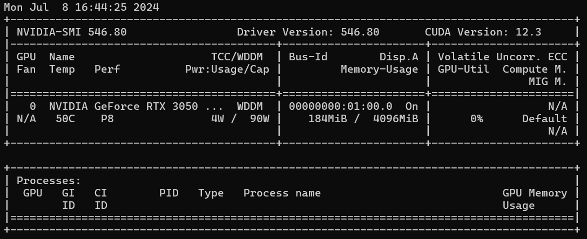

# 1 YOLOv5
## 1.1 代码
参见官网
# 2 BlazeFace
## 2.1 代码
[参见](https://colab.research.google.com/github/googlesamples/mediapipe/blob/main/examples/face_detector/python/face_detector.ipynb#scrollTo=tzXuqyIBlXer)
# 3 安装
依赖可以直接从requirements.txt下载
使用的是python3.9

